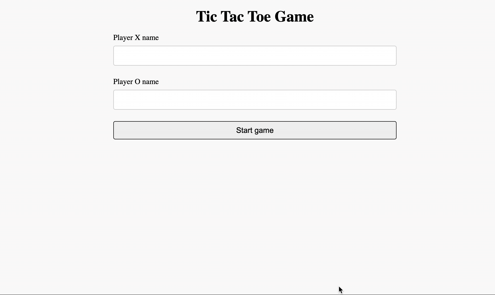

# TicTackToe

<a href="https://abuhani.github.io/tic-tac-toe/" target="_blank">Tic Tac Toe Demo</a>

Tic Tac Toe using Angular framework. 

- Visual representation of the board
- Clicking on an empty tile adds an X or O depending on the turn.
- Should get the name of the players before starting the game.
- A display saying the name of whose turn it is.
- If there's a winner, a display of the winner’s name.
- If there's a winner, clicking on an empty tile should do nothing.
- A reset button resets the game.
- <a href="https://abuhani.github.io/tic-tac-toe/" target="_blank">Demo</a>

## Development server

Run `ng serve` for a dev server. Navigate to `http://localhost:4200/`. The app will automatically reload if you change any of the source files.

## Code scaffolding

Run `ng generate component component-name` to generate a new component. You can also use `ng generate directive|pipe|service|class|guard|interface|enum|module`.

## Build

Run `ng build` to build the project. The build artifacts will be stored in the `dist/` directory.

## Running unit tests

Run `ng test` to execute the unit tests via [Karma](https://karma-runner.github.io).

## Running end-to-end tests

Run `ng e2e` to execute the end-to-end tests via a platform of your choice. To use this command, you need to first add a package that implements end-to-end testing capabilities.

## Further help

To get more help on the Angular CLI use `ng help` or go check out the [Angular CLI Overview and Command Reference](https://angular.io/cli) page.
